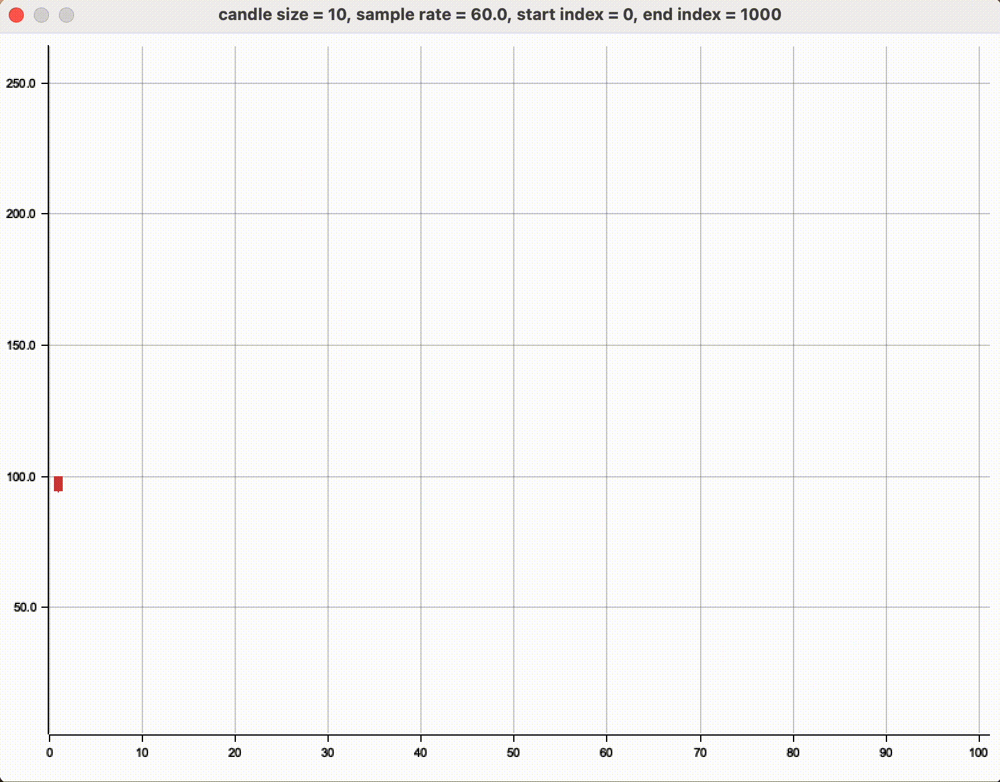

# Charts

## Grafico a candele interattivo


Eseguibile tramite il seguente comando

```rust
cargo run -- example interactive_candles 
```

### Instructions:

- ←/→ = Previous/next series
- ↑/↓ = Adjust candle size
- +/- = Adjust sample rate
- 1/2 = Adjust start index
- 9/0 = Adjust end index
- P = Start/Stop
- R = Restart
- \<Esc> = Exit

## Base plot

Per eseguire tutti i grafici

```rust
cargo test
```

### una serie

```rust
use plot_graph::base_plot;
base_plot::plot_single_series_image(vec![1., 3.], "file_name", "caption");
```

### più serie

```rust
use plot_graph::base_plot;
base_plot::plot_multiple_series_image(vec![vec![..], vec![..], ..], "file_name", "caption");
```

## Candlestick chart

```rust
use candles::plot;
candles::plot_image(vec![..], < candle_size >, "file_name", "caption");
```

## Bar chart (liquidity chart)

```rust
use liquidity_chart::plot;
liquidity_plot::plot_image(vec![vec![..], ..], vec![<market_names>], "file_name");
```
