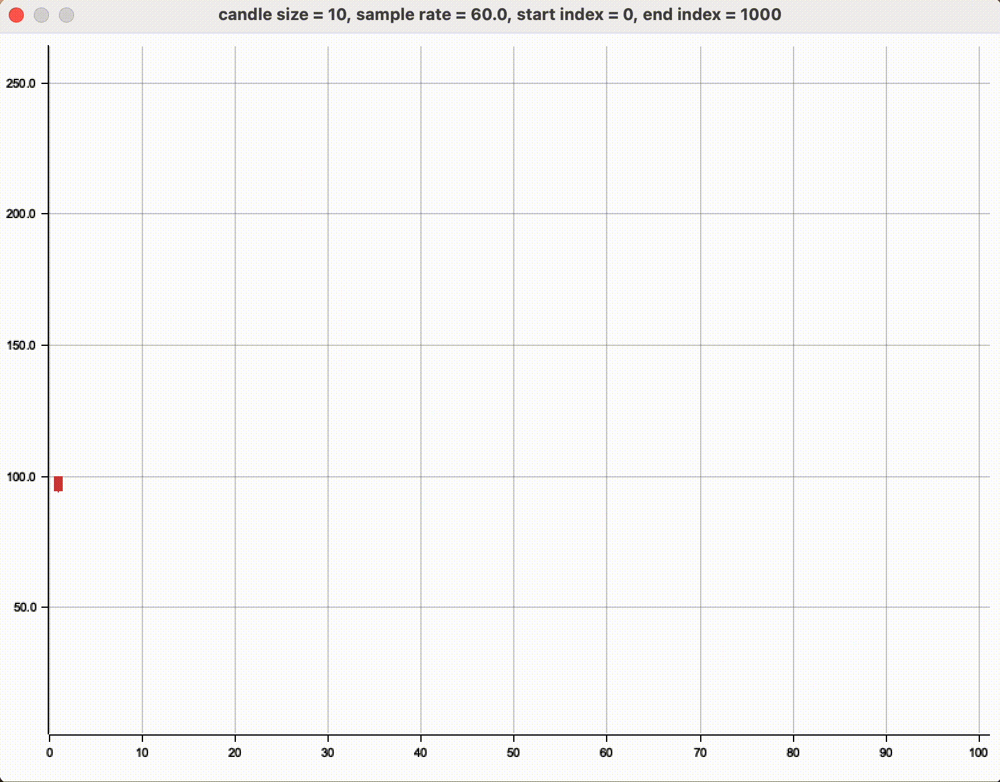

# Charts

## Grafico a candele interattivo


Eseguibile tramite il seguente comando

```rust
cargo run --example interactive_candlestick_chart 
```

### Instructions:

- ←/→ = Previous/next series
- ↑/↓ = Adjust candle size
- +/- = Adjust sample rate
- 1/2 = Adjust start index
- 9/0 = Adjust end index
- P = Start/Stop
- R = Restart
- \<Esc> = Exit

## Grafico a barre interattivo

Eseguibile tramite il seguente comando

```rust
cargo run --example interactive_bar_chart
```

### Instructions:

- ←/→ = Previous/next series
- +/- = Adjust sample rate
- 1/2 = Adjust start index
- 9/0 = Adjust end index
- P = Start/Stop
- R = Restart
- \<Esc> = Exit

## Base plot

Per eseguire tutti i grafici

```rust
cargo test
```

### una serie

```rust
base_chart::plot_single_series_image(vec![1., 3.], "file_name", "caption");
```

### Base chart multiple series

```rust
base_chart::plot_multiple_series_image(vec![vec![..], vec![..], ..], "file_name", "caption");
```

## Candlestick chart

```rust
candlestick_chart::plot_image(vec![..], < candle_size >, "file_name", "caption");
```

## Bar chart

```rust
bar_chart::plot_image(vec![..], vec![<captions>], "file_name");
```
