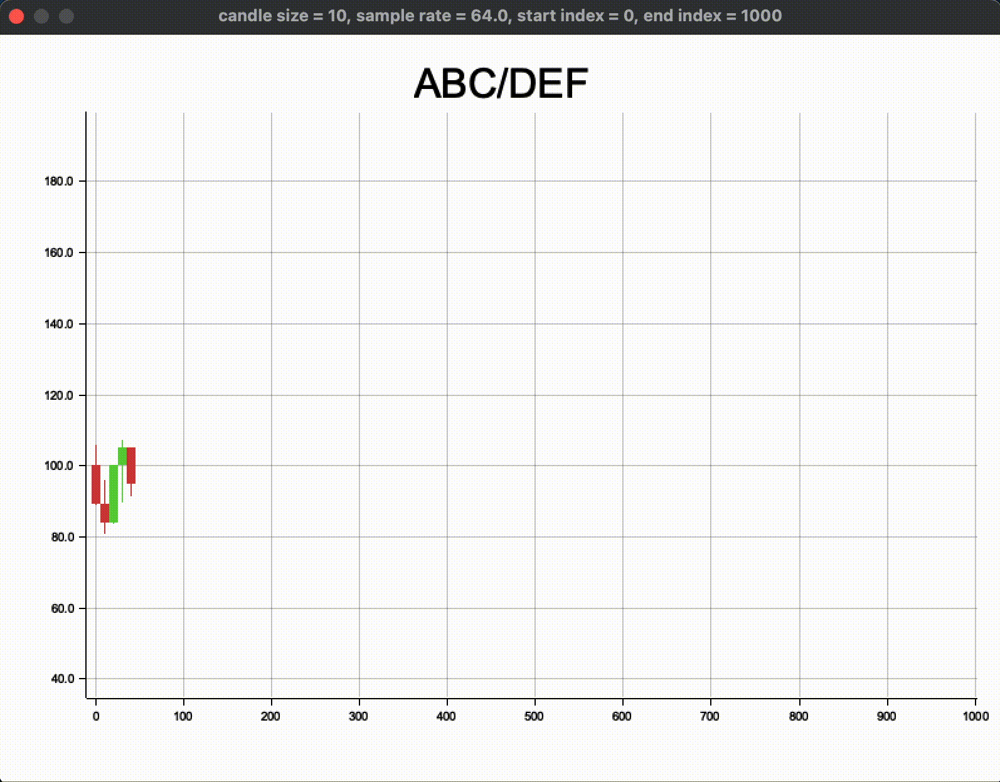

[TOC]

# Plot

This library is part of the Advanced Programming course project of the University of Trento.

The project's goal is to create a market and a trading bot that interacts with 3 of the markets created by the other groups.

This library provides quick and easy access to the creation of some specific types of charts, which help visualize the data generated in the main project.

The functions provided by this library are of two types, for:
- Interactive charts
- Static charts

## Interactive charts

### Interactive candlestick chart


Executable with the following command

```rust
cargo run --example interactive_candlestick_chart 
```

#### Instructions:

- ←/→ = Previous/next series
- ↑/↓ = Adjust candle size
- +/- = Adjust sample rate
- 1/2 = Adjust start index
- 9/0 = Adjust end index
- P = Start/Stop
- R = Restart
- \<Esc> = Exit

### Interactive bar chart


Executable with the following command

```rust
cargo run --example interactive_bar_chart
```

#### Instructions:

- ←/→ = Previous/next series
- +/- = Adjust sample rate
- 1/2 = Adjust start index
- 9/0 = Adjust end index
- P = Start/Stop
- R = Restart
- \<Esc> = Exit

## Static charts

Two types of calls are available for each static chart type
- A basic one where it is sufficient to pass the data for the chart;
- One with more parameters that allow you to change the drawing background and the style of the chart;

To create all the possible charts, execute the following command

```rust
cargo test
```

### Candlestick chart

```rust
use plot::candlestick_chart;
candlestick_chart::plot_image(vec![1., 2., ..], <candle size>, "file_name", "caption");
```

[Function with more parameters](https://github.com/Giacomo-Sanna/plot/blob/main/src/candlestick_chart.rs#L19)

### Bar chart multiple series

```rust
use plot::bar_chart;
bar_chart::plot_image(vec![..], vec![<captions>], "file_name");
```

[Function with more parameters](https://github.com/Giacomo-Sanna/plot/blob/main/src/bar_chart.rs#L16)


### Base chart multiple series

```rust
use plot::bar_chart;
base_chart::plot_multiple_series_image(vec![vec![..], vec![..], ..], "file_name", "caption");
```

[Function with more parameters](https://github.com/Giacomo-Sanna/plot/blob/main/src/base_chart.rs#L51)


